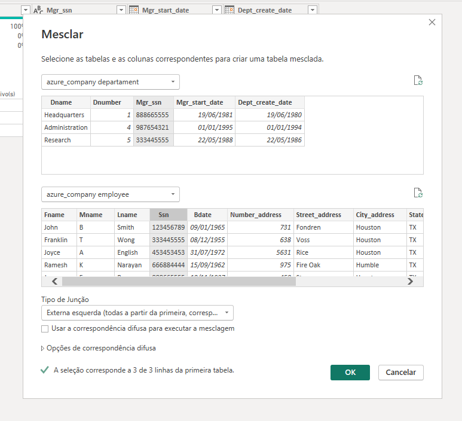
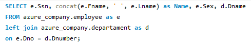
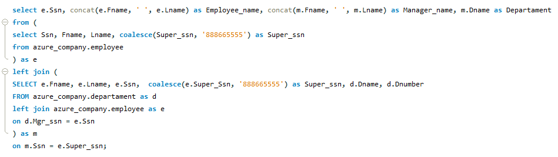

# Desafio Final DIO Power BI - Python Data Analytics - Processando e Transformando Dados com Power BI 

Desafio final exigido para o módulo de Power BI no curso de Python Data Analytics. Aqui desenvolvemos um relatório com dados proveniente do banco de dados MySQL e aplicamos as técnicas de processamento e transformação de dados abordadas no módulo de Power BI.

## Coleta
Os dados foram extraídos de um banco de dados MySQL on-premise. O SGDB Workbench foi utilizado para realizar a criação do *database* e das respectivas *tables*. Nele executamos os seguintes scripts para persistir os nossos dados em nosso banco MySQL:

| Script | Finalidade |
|------|-------|
| [script_bd_company.sql](.script_bd_company.sql) | Criar o database azure_company e definir as tabelas e os seus schemas. |
| [insercao_de_dados_e_queries_sql.sql](.insercao_de_dados_e_queries_sql.sql) | Persistir os dados na estrutura previamente criada com o script anterior. |

## Transformações
Realizamos o processo de transformação com o Power Query após efetivar a conexão entre o PowerBI e o database **azure_company** (MySQL).

0. Inicialmente, excluímos todas as colunas criadas automaticamente pelo PowerBI durante a importação dos dados. Isso foi feito para melhorar a visualização dos dados e melhorar o desempenho do PowerBI durante o manipulação desses dados.
   
1. Depois relizamos alterações no cabeçalho das tabelas como melhoria aos dados. Essas modificações nas nomenclaturas foram:

Tabela| Nomenclatura Antes | Nomenclatura Depois |
|----|---|----|
| employee | Minit | Mname |

Além disso, verificamos o tipo de dados para cada coluna e realizamos a seguite modificação:
- Definimos a coluna **Salary** em *employee* como: **Double**(Número decimal fixo)

2. No processo de normalização dos dados, aplicamos N2 para separar colunas complexas, como em:

| Tabela | Coluna Original | Colunas Derivadas |
|----|----|----|
| employee | - Address | - Number_address <br /> - Street_address <br /> - City_address <br /> - State_address <br /> |


3. Valor **null** foi encontrado na base de dados na seguinte ocorrência: 

- Coluna **Super_ssn** na tabela *employee*.
Verificamos se o dado null poderia ser o indício de um gerente principal. Para isso aplicamos a seguinte query:

    ```
    select e.Fname, e.Lname, e.Ssn, e.Super_ssn, d.Dname, d.Dnumber from azrue_company.departament as d
    left join azrue_company.employee as e
    on d.Mgr_ssn = e.Ssn;
    ```

Verificamos com a query acima que existe 1 gerente para cada departamento (3 gerentes para 3 departamentos). Entretanto, o gerente do departamento **Hearquartes** gerencia os demais departamentos (**Research** e **Administration**). Logo, podemos inferir que o gerente de **Hearquartes** e o gerente principal da organização.

Assim, escolhemos por substituir o valor *null* do gerente de **Hearquartes** pelo seu respectivo **Ssn** em employee para garantir a consistência dos campos e clareza dos dados. 

O mesmo resultado pode ser obtido ao realizar o procedimento **mesclar consultas como novas** no Power Query. Aqui, precisamos selecionar *departament* e *employee*, selecionamos as colunas **Mgr_ssn**(departament) e **Ssn**(employee). Em seguida, escolhemos o **Tipo de junção: Extrema esquerda** para gerar a nova tabela com os gerentes de cada departamento. 



4. Realizamos um left join entre as tabelas *employee* e *departament* para gerar uma tabela employee mais rica e exulto. Esse join gerou uma tabela com as seguintes colunas:

| Coluna | Definição |
|----|----|
| **Name** | Nome do colaborador concatenando o seu *Fname* e *Lname* |
| **Sex** | O respectivo sexo de cada colaborador |
| **Dname** | Nome do departamento respectivo a cada colaboador |

<!--  -->

```
select e.Ssn, concat(e.Fname, ' ', e.Lname) as Name, e.Sex, d.Dname
from azure_company.employee as e
left join azure_company.departament as d
on e.Dno = d.Dnumber;
```

5. Outra tabela gerada é a que relaciona os colaboradores com os seus respectivos gerentes (employees_managers). Para gerar esta tabela aplicamos um left join entre *employee* e *managers*. Essa operação foi realizada com a seguinte query:
   
   <!--  -->
   
```
SELECT e.Ssn, concat(e. Fname, e. Lname) as Employee_name, concat(m. Fname, m. Lname) as Manager_name, m.Dname as Departament
from (
SELECT Ssn, Fname, Lname, coalesce (Super_ssn, '888665555') as Super_ssn
FROM azure_company.employee
) as e
LEFT JOIN (
SELECT e.Fname, e.Lname, e.Ssn, coalesce (e.Super Ssn, '888665555') as Super_ssn, 
d.Dname, d.Dnumber
FROM azure_company.departament as d
LEFT JOIN azure_company.employee as e
ON d.Mgr_ssn = e.Ssn
) as m
ON m.Ssn = e.Super_ssn;
```

Assim, obtermos uma tabela com as seguintes colunas:
| Coluna | Definição |
|-----|-----|
| **Ssn** | ID do colaborador |
| **Employee_name** | Nome do colaborador obtido pela concatenação entre *Fname* e *Lname* |
| **Manager_name** | Nome do gerente obtido pela concatenação entre *Fname* e *Lname* |
| **Departament** | Nome do departamento respectivo ao coladorador |
   

6. Como pedido no desafio, realizamos a operação de mescla entre a tabela *departament* e *dept_locations* e geramos a tabela *dept_locations_complete*. 

>[!NOTE]
>A operação de mescla é recomendada para este tipo de caso, pois esta é semalhante a operação de join no sql ao realizar a junção entre tabelas por meio de uma coluna em comum e mantendo os identificadores unicos (no caso de chaves primárias e estrangeiras). Já na operação de operação de combinação, ocorre uma concatenação de entres as tabelas e os dados são adicionados em novas linhas, levando em consideração as colunas de ambas as tabelas. Com isso, colunas com valores unicos não são preservados e podem ser repiclados diversas vezes na tabela resultante, descaracterizando a existencia da coluna e a objetividade dos dados. 

## Relatório

O relatório gerado com power BI [azure_company.pbix](./report_powerBI/azure_company.pbix) é composto de 4 páginas onde verificamos 4 abordagem para os dados disponibilizados:
- Projetos
- Departamentos
- Colaboradoes
- Salarial e Dependentes

### Projetos
Aqui verificamos que os projetos **Product X** e **Product Z** apresentam a menor quantidades de colaboradores disponiveis. Entretanto, estes projetos apresentam uma grande carga horária de trabalho (maior ou iqual a 50 horas). Por outros lado, projetos menos ativos na companhia (maior ou iqual a 40 horas), como: **Product Y** e **Reorganization** contam com 3 pessoas vinculadas. Além disso, verificamos que apenas 2 membros da empresa apresentam um carga horária menor que 40 horas semanas: **Jennifer Wallace(35)** e **James Borg(0)**. Por fim, a maioria da equipe está alocada em **2** projetos, exceto: **Franklin Wong(4)**, **Ramesh Narayan(1)** e  **James Borg(0)**.

Distribuir melhor a carga horaria entre os membros da equipe e equalizar a participação ente os projetos pode ser um caminho para potencializar os resultados da empresa.

### Departamentos
Os setores de **Research Houston** e **Research Bellaire** apresentam as menores participação de colaboradores mas desempenha uma das maiores cargas horárias (>= 40 horas). Por outro lado, **Research Sugarland** e **Headquarters Houston** seguem comportamento oposto dos setores sitados anteriormente. O depatamento **Administration Stafford** é o mais ativo da empresa com carga horária maior que 100 horas, sendo o maior foco da organização. Quanto a exclusividade, os setores: **Administration Stafford(2)** e **Research Houston(1)** apresentam colaboradores exclusivos. Em sentido oposto, **Franklin Wong** transita por 4 departamentos diferentes.

### Colaboradores
O setor que apresenta o maior quantidade de colaboradores é **Reserch(4)** e também despende mais recursos para custear o serviço desenvolvido. Nesta abordagem verificamos que **James Borg** pertence de maneira isolada ao setor **Headquarters** e recebe o maior vencimento da empresa. 

Os gerentes da empresa são:
- Franklin Wong
- James Borg (Gerente Master)
- Jennifer Wallace

Dentre os gerentes, Franklin Wong é o que apresenta menor discrepancia salarial com relação a um membro da sua equipe. E Jennifer Wallace é a que gerencia o menor grupo de colaboradores.

Com relação ao sexo, excluindo o setor **Headquarters**, **Reserach** apresentam maior percentual de integrantes masculinos e **Administration** apresenta comportamento inverso. 

Percebemos que os setores são diveros entre si e isso se extende para os seus gerentes. Verificando os gerentes e os colaboradoes constatamos que Franklin Wong mesmo sendo o gerente que integra a maior equipe e atuando em maior variedade de setores é o gerente que apresenta o menor vencimento. Além disso, percebemos que James Borg é o responsavel pelos demais gerente.

### Salarial & dependentes
Os vencimentos e a proporção de intregantes na empresa em relação a sexo, em uma perspectiva macro, apresentam baixa discrepancia dendendo o percentual de vencimentos para os integrantes do sexo masculino. Analisando este mesmo assunto considerando os departamentos, é verificavel que o setor **Administration** contém maioria de intregantes do sexo femino, seguindo um percentual parecido o vencimento é distribuído para o sexo feminimo. Por outro lado, no setor **Research** segue o mesmo padrão para o sexo masculino. Em ambos os setores, o percentual de vencimentos tende a aumentar para o sexo correspondente do administrador do setor.

Outro tema abordado são os dependentes do colaboradores. O setor **Research** apresentam mais de 85% do dependentes da empresa e o restante estão relacionado a colaboradores do setor **Administration**. O maior percentual de dependentes são filhos dos colaboradores, aproximadamente 60%, os demais são conjuges. Além disso, os filhos são dependentes somente de colaboradores que pertencem ao setor **Research**.

### Conclusão
Os dados demonstram um desequilibrio entre a atuação dos gerentes e de alguns colaboradores. Projetos com carga horária consideravel, como **Product X** e **Product Z** contam com quantidade deficitária de funcionários, enquanto o cenario oposto é visto em **Product Y** e **Reorganization**. O mesmo comportamento deficitário pode ser observado nos setores **Research Houston** e **Research Bellaire**, enquanto o oposto é visto em **Research Sugarland** e **Headquarters Houston**.

O integrante mais engajado, tanto nos projetos quanto nos setores da empresa, é o gerente de **Research** Franklin Wong, entretanto este é o integrante com o menor vencimento salarial entre os gerentes. Além disso, Franklin Wong gerencia a maior equipe da empresa. Por outro lado, percebemos que o gerente master James Borg não está associado aos projetos e demais setores. Entretanto, este atua administrando os demais gerentes. O outro gerente é Jennifer Wallace, e percebemos que o setor que ela gerencia é o setor que apresenta a maior proporção de mulheres na empresa.

A proporção entre vencimentos e o sexos dos integrantes apresentam baixa variação, com os salários tendendo para integrantes do sexo masculino. Além disso, verificamos que a cada 2 integrantes do sexo masculino existe uma integrante do sexo feminino. Neste ponto verificamos um desequilibrio que poderia ser investigado pela empresa. 

Por fim, os dependentes dos colaboradores estão em sua grande maioria associados a integrantes do setor **Research**, sendo a maior parte destes dependentes composta por filhos.


